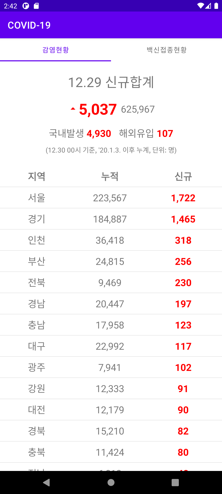
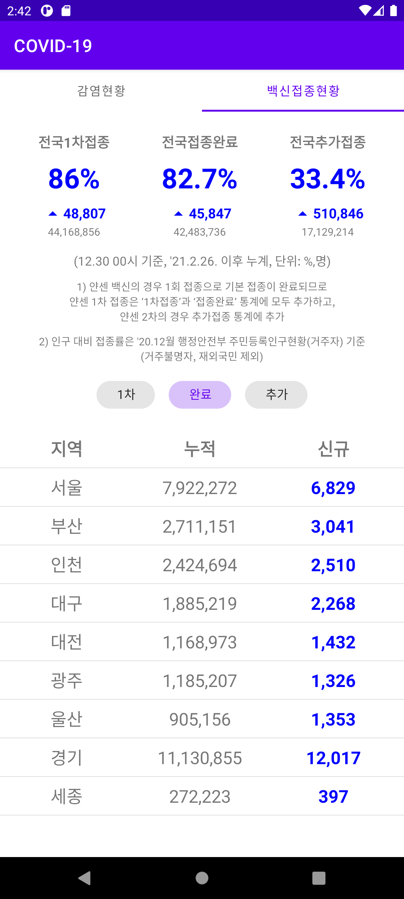

<div>


</div>

# Data Binding
The current Status of Covid-19 and Vaccination in Korea using *Data Binding*.

Click to see the [Covid-19 API](https://www.data.go.kr/tcs/dss/selectApiDataDetailView.do?publicDataPk=15043378) and [Vaccination API](https://www.data.go.kr/tcs/dss/selectApiDataDetailView.do?publicDataPk=15077756).

<div>


</div>

#### 1. View Binding
- `View Binding` is Library of Android Jetpack.
- `View Binding` allows to more easily interacts with views.
- `View Binding` generates a binding class for each XML layout files.
- `View Binding` replaces *findViewById*.
```groovy
// build.gradle in Module
android {
    ...
    buildFeatures {
        viewBinding true
    }
}
```
<br>

#### 1-1. Create View Binding Class
- Binding class contains references to *all views* in XML layout files.
- Convert the xml layout name to Pascal case and add `Binding`.
- Using generated binding class, Call `inflate()` method to create an instance of the binding class.
<br>

#### 1-2. View Binding in Activity
- Pass the root view to `setContentView()`.
```kotlin
private val binding by lazy { ActivityMainBinding.inflate(layoutInflater) }

override fun onCreate(savedInstanceState: Bundle?) {
    super.onCreate(savedInstanceState)
    setContentView(binding.root)
}
```
<br>

#### 1-3. View Binding in Fragment
- Binding class of Fragment is only valid between `onCreateView()` and `onDestroyView()`.
- Instance declared nullable, After creating in `onCreateView()`, set it to null in `onDestroyView()`.
  - Fragments outlive views.
- Return the root view from the `onCreateView()` method.
```kotlin
private var _binding: FragmentInfectionBinding? = null
private val binding get() = requireNotNull(_binding)

override fun onCreateView(
    inflater: LayoutInflater,
    container: ViewGroup?,
    savedInstanceState: Bundle?
): View {
    _binding = FragmentInfectionBinding.inflate(inflater, container, false)
    return binding.root
}

override fun onDestroyView() {
    super.onDestroyView()
    _binding = null
}
```
<br>

#### 1-4. Ignore View Binding
- Can ignore that a layout file creates a binding class.
```xml
<androidx.constraintlayout.widget.ConstraintLayout
    ...
    tools:viewBindingIgnore="true">
</androidx.constraintlayout.widget.ConstraintLayout>
```
<br>

#### 2. Data Binding
- `Data Binding` is Library of Android Jetpack.
- `Data Binding` allows to bind UI components *in layouts to data sources*.
- `Data Binding` uses *a declarative format* rather than programmatically.
- `Data Binding` can *remove many UI framework calls* in activities(fragments).
- Easy to maintain activities(fragments).
- `Data Binding` help prevent *memory leaks* and *null pointer exceptions*.
  - Improve app's performance.
  <br>

#### 2-1. Get started The Data Binding Library
- Data Binding Library can be used with devices running Android 4.0 (API level 14) or higher.
- And on Gradle version 1.5.0 and higher.
- *To use data binding in a Kotlin project, should apply the kotlin-kapt plugin*.
```groovy
// build.gradle in Module
plugins {
    ...
    id 'kotlin-kapt'
}

android {
    ...
    buildFeatures {
        dataBinding true
    }
}
```
<br>

#### 2-2. The Data Binding layout files are different.
- When Alt+Enter on the root layout in the xml file, Can see *Covert to data binding layout*.
```xml
<androidx.constraintlayout.widget.ConstraintLayout
    xmlns:android="http://schemas.android.com/apk/res/android"
    xmlns:app="http://schemas.android.com/apk/res-auto"
    xmlns:tools="http://schemas.android.com/tools"
    android:layout_width="match_parent"
    android:layout_height="match_parent"
    tools:context=".presentation.main.MainActivity">
    
    ...
    
</androidx.constraintlayout.widget.ConstraintLayout>
```
- The root view changed from *ConstraintLayout* to `layout`.
- After `layout` tag, `data` and views follow.
```xml
<layout xmlns:android="http://schemas.android.com/apk/res/android"
    xmlns:app="http://schemas.android.com/apk/res-auto"
    xmlns:tools="http://schemas.android.com/tools">

    <data>

    </data>

    <androidx.constraintlayout.widget.ConstraintLayout
        android:layout_width="match_parent"
        android:layout_height="match_parent"
        tools:context=".presentation.main.MainActivity">
        
        ...
        
    </androidx.constraintlayout.widget.ConstraintLayout>
</layout>
```
<br>

#### 2-3. Variable in Data Binding Layout
- Declare `variable` tags to be used in the XML layout files In `data` tag.
- Using `"@{}"` syntax, can refer to the properties of a `variable`.
- The variable types are inspected at compile time.
- The variables take the default value until the setter is called.
  - 0 for int, false for boolean etc.
```xml
<data>
    
    <variable
    	name="infectionEntity"
        type="com.kimym.covid.data.entity.InfectionEntity" />
</data>
...
<TextView
    android:layout_width="0dp"
    android:layout_height="wrap_content"
    android:text="@{infectionEntity.koreanName}" />
```
<br>

#### 2-4. Imports and includes
- Declaring `import` tag in `data` tag can allow to easily reference classes.
- Imported types can be used as type references in variables and expressions.
```xml
<data>
    <import type="com.kimym.covid.util.Status" />
    <import type="com.kimym.covid.util.Resource" />
    <variable
    	name="infectionResource"
        type="Resource&lt;com.kimym.covid.data.entity.InfectionEntity>"/>
```

- When there are classes with same name, can change name in the layout files using `alias`.
```xml
<import type="android.view.View"/>
<import type="com.example.real.estate.View"
        alias="Vista"/>
```

- Static fields and methods of Imported types can also be used.
```xml
<import type="com.kimym.covid.util.IntExtensionKt" />
...
<TextView
    ...
    android:text="@{IntExtensionKt.decimalFormat(infectionResource.data.incDec)}"/>
```
- Variables may be passed into an included layout's binding.
- Use *the app namespace and the variable name* in the included layout files.
```xml
<!-- Containing Layout -->
<data>
    
    <variable
        name="viewModel"
        type="com.kimym.covid.presentation.infection.InfectionViewModel" />
</data>
...
<include
    layout="@layout/loading_state"
    app:onClick="@{() -> viewModel.getInfectionInformation()}"
    app:resource="@{viewModel.infectionEntity}" />
```
```xml
<!-- included Layout -->
<data>

    <import type="com.kimym.covid.util.Resource" />

    <variable
        name="resource"
        type="Resource" />

    <variable
        name="onClick"
        type="android.view.View.OnClickListener" />
</data>
```
- Data Binding doesn't support `merge` elements.
<br>

#### 3. Instance of Data Binding Class
- [Review View Binding](#1-2-view-binding-in-activity).
- A binding class is generated based on the name of the layout file.
- The class is placed in a `databinding` package under the module package.
  - `com.kimym.covid.databinding.FragmentInfectionBinding`
```kotlin
override fun onCreate(savedInstanceState: Bundle?) {
    super.onCreate(savedInstanceState)

    val binding: ActivityMainBinding = DataBindingUtil.setContentView(this, R.layout.activity_main)
}
```

- Can create using a *LayoutInflater* in Activity.
````kotlin
val binding: ActivityMainBinding = ActivityMainBinding.inflate(layoutInflater)
````

- Also, can create in *Fragment* or *RecyclerView.Adapter*.
```kotlin
val binding = FragmentInfectionBinding.inflate(layoutInflater, container, false)
// or
val layoutId = R.layout.fragment_infection
val binding = DataBindingUtil.inflate(inflater, layoutId, container, false)
```
<br>

#### 3-1. Binding Data
- Created instance of Data Binding Class holds all the bindings from *the layout properties*.
- The binding class converts the IDs in XML layout files to Camel case.
- In activities(fragments), access it just like would access a binding property.
```kotlin
private val viewModel by viewModels<InfectionViewModel>()
binding.viewModel = viewModel
```
<br>

#### 3-2. Immediate Binding
- When changes to the binding occurs, it is scheduled to reflect before the next frame.
- To force execution, use the `executePendingBindings()` method.
<br>

#### 4. Expression language
- The expression language looks a lot like expressions found in managed code.

| expression           | operator                                          |
| -------------------- | ------------------------------------------------- |
| Mathematical         | `+`,`-`, `/`, `*`, `%`                            |
| String concatenation | `+`                                               |
| Logical              | `&&`, `\|\|`                                      |
| Binary               | `&`, `\|`, `^`                                    |
| Unary                | `+`, `-`, `!`, `~`                                |
| Shift                | `>>`, `>>>`, `<<`                                 |
| Comparison           | `==`, `>`, `<`, `>=`, `<=` (Mark `<` with `&lt;`) |
| Instance             | `instanceof`                                      |
| Grouping             | `()`                                              |
| Literals             |                                                   |
| Cast                 |                                                   |
| Method calls         |                                                   |
| Field access         |                                                   |
| Array access         | `[]`                                              |
| Ternary operator     | `?:`                                              |
<br>

#### 4-1. Null pointer exceptions
- Generated Data Binding code checks for null.
  - [As above](#2-data-binding), know that Data Binding prevents null pointer exceptions.
- eg) FragmentInfectionBindingImpl In java (generated).
```java
if (infectionResource != null) {
    // read infectionResource.status
    infectionResourceStatus = infectionResource.getStatus();
    // read infectionResource.data
    infectionResourceData = infectionResource.getData();
}

// read infectionResource.status == Status.SUCCESS
infectionResourceStatusStatusSUCCESS = (infectionResourceStatus) == (com.kimym.covid.util.Status.SUCCESS);
if (infectionResourceData != null) {
    // read infectionResource.data.defCnt
    infectionResourceDataDefCnt = infectionResourceData.getDefCnt();
    // read infectionResource.data.overFlowCnt
    infectionResourceDataOverFlowCnt = infectionResourceData.getOverFlowCnt();
    // read infectionResource.data.localOccCnt
    infectionResourceDataLocalOccCnt = infectionResourceData.getLocalOccCnt();
    // read infectionResource.data.incDec
    infectionResourceDataIncDec = infectionResourceData.getIncDec();
}
```
<br>

#### 4-2. Null coalescing operator
- `??` operator chooses the left operand if it isn't null.
- If the left operand is null, the right operand.
- Similar with Ternary operator.
```xml
android:text="@{infectionEntity.koreanName ?? infectionEntity.englishName}"
<!-- or -->
android:text="@{infectionEntity.koreanName != null ? infectionEntity.koreanName : infectionEntity.englishName}"
```
<br>

#### 4-3. View references
- Can refer other views in the same layout.
- eg) EditText with ID et_input and TextView with ID tv_output.
  - Text in TextView is the same as text in EditText.
  - Change example_text to Camel case.
  - Access with `"@{etInput.text}"`.
```xml
<EditText
    android:id="@+id/et_input"
    android:layout_height="wrap_content"
    android:layout_width="match_parent"/>
<TextView
    android:id="@+id/tv_output"
    android:layout_width="wrap_content"
    android:layout_height="wrap_content"
    android:text="@{etInput.text}"/>
```
<br>

#### 4-4. Collections
- Also, collections can be bound with layout files.
  - `Array`, `List`, `Map` etc.
- Can be accessed using the `[ ]` operator.
- Mark `<` with `&lt;`.
```xml
<data>
    
    <import type="java.util.List"/>
    
    <import type="android.util.SparseArray"/>
    
    <import type="java.util.Map"/>
    
    <variable
        name="list"
        type="List&lt;String>"/>
    
    <variable
        name="sparse"
        type="SparseArray&lt;String>"/>
    
    <variable
        name="map"
        type="Map&lt;String, String>"/>
    
    <variable
        name="index"
        type="int"/>
    
    <variable
        name="key"
        type="String"/>
</data>
```

```xml
<TextView
    ...
    android:text="@{list[index]}"/>    
<TextView
    ...
    android:text="@{sparse[index]}"/>
<TextView
    ...
    android:text="@{map[key]}"/>
<TextView
    ...
    android:text="@{map.key}"/>
```
<br>

#### 4-5. String literals
- When use double quotes in the expression.
- Can use single quotes to surround the attribute value.
```xml
<TextView
    ...
    android:text='@{map["myName"]}'/>
```
- When use double quotes to surround the attribute value.
- Can use back quotes.
```xml
<TextView
    ...
    android:text="@{map[`myName`]}"/>
```
<br>

#### 4-6. Resources
- Can use app resources in familiar syntax already.
```xml
<TextView
    ...
    android:padding="@{large? @dimen/largePadding : @dimen/smallPadding}"/>
```
- Can set resource parameters.
```xml
<TextView
    ...
    android:text="@{@string/vaccine_standard(standardDate)}"/>
```
<br>

#### 5. Event handling
- Data Binding can write expression handling events such as `onClick()` method.
- Event attribute names are determined by the name of the listener.
  - The `android:onClick` attribute is associated with the `onClick()` method of *View.OnClickListener*.
- Let's take a look at the BindingAdapter.
```java
@BindingAdapter({"android:onClick", "android:clickable"})
public static void setClickListener(View view, View.OnClickListener clickListener, boolean clickable) {
    view.setOnClickListener(clickListener);
    view.setClickable(clickable);
}
```
- There are two ways: *Method references* and *Listener bindings*.
<br>

#### 5-1. Method references
- The expression is processed at compile time.
- So if the method doesn't exist or its signature is incorrect, a compile time error occurs.
- *View.OnClickListener* returns void and receives View as a parameter as follows.
```java
// android.view.View
public interface OnClickListener {
    void onClick(View var1);
}
```
- The signature of the method in the expression must exactly match the signature of the method in the listener object.
  - When Method references, the method must return void and receive View.
```kotlin
class InfectionViewModel : ViewModel() {
    fun getInfectionInformation(view: View) {
        ...
    }
}
```

```xml
<data>
    
    <variable
        name="viewModel"
        type=".InfectionViewModel" />
</data>
...
<TextView
    ...
    android:onClick="@{viewModel::getInfectionInformation}" />
```
<br>

#### 5-2. Listener bindings
- Listener bindings are binding expressions that run when an event happens.
- It is similar to Method references, but can be used a little more differently.
  - Only return value must match.
- Data Binding automatically creates the necessary listener and registers it for the event.
  - Therefore, when an event occurs, Data Binding checks the method.
```kotlin
class InfectionViewModel : ViewModel() {
    fun getInfectionInformation() {
        ...
    }
}
```
```xml
<data>
    
    <variable
        name="viewModel"
        type=".InfectionViewModel" />
</data>
...
<TextView
    ...
    android:onClick="@{() -> viewModel.getInfectionInformation()}" />
```

- Unlike a, no view parameters are defined.
- Listener bindings provide two choices for listener parameters.
  - *Ignore all parameters* and *Name all of them*.
```xml
<TextView
    ...
    android:onClick="@{(view) -> viewModel.getInfectionInformation()}" />
```

- If want to use the parameter in the expression.
```kotlin
class InfectionViewModel : ViewModel() {
    fun getInfectionInformation(view: View, key: String) {
        ...
    }
}
```
```xml
<TextView
    ...
    android:onClick="@{(theView) -> viewModel.getInfectionInformation(theView, key)}" />
```

- Can use a lambda expression with more than one parameter.
```kotlin
class InfectionViewModel : ViewModel() {
    fun getInfectionInformation(key: String, selected: Int) {
        ...
    }
}
```
```xml
<TextView
    ...
    android:onClick="@{(view, selected) -> viewModel.getInfectionInformation(key, selected)}" />
```

- If the event returns a value whose type isn't void, then expressions must return the same type.
- Listener bindings feature is available with Android Gradle Plugin for Gradle version 2.0 and later.
<br>

#### 6. BindingAdapter
- `BindingAdapter` can be used to solve more complex Data Binding situations.
- `BindingAdapter` is responsible for setting the value.
- The Data Binding Library provides a huge amount of [BindingAdapters](https://android.googlesource.com/platform/frameworks/data-binding/+/master/extensions/baseAdapters/src/main/java/android/databinding/adapters/).
  - They are declared as static methods.
  - Static Methods can be created by adding functions to the top level of a Kotlin file.
  - Or as extension functions on the class.
- eg) `android:text` in TextViewBindingAdapter.
```java
@BindingAdapter("android:text")
public static void setText(TextView view, CharSequence text) {
	final CharSequence oldText = view.getText();
    if (text == oldText || (text == null && oldText.length() == 0)) {
        return;
    }
    if (text instanceof Spanned) {
        if (text.equals(oldText)) {
            return; // No change in the spans, so don't set anything.
        }
    } else if (!haveContentsChanged(text, oldText)) {
        return; // No content changes, so don't set anything.
    }
    view.setText(text);
}
```
<br>

#### 6-1. Using BindingAdapter to create custom attributes.
- eg) A property that is visible or invisible depending on its value.
```kotlin
object BindingAdapters {
    @BindingAdapter("visibleOrNot")
    @JvmStatic
    fun visibleOrNot(view: View, visible: Boolean) {
        view.visibility = when (visible) {
            true -> View.VISIBLE
            false -> View.INVISIBLE
        }
    }
}
```
- It can be used to the `app:visibleOrNot(or only "visibleOrNot")` attribute in XML layout files.
- It works as an attribute of *View*.
  - Because the first parameter is a View.
- So, the parameter types are important.
- Can also be used this way.
```kotlin
@BindingAdapter("visibleOrNot")
fun View.visibleOrNot(visible: Boolean) {
    visibility = when (visible) {
        true -> View.VISIBLE
        false -> View.INVISIBLE
    }
}
```
- In this case, this is an extension function of View.
- Therefore, if that part is modified, `BindingAdapter` can be used as a property of a specific class.
<br>

#### 6-2. BindingAdapter with multiple parameters
- In 5-1, the visibility of the view was adjusted with a boolean value.
- So what does a `BindingAdapter` look like?
  - This is BindingAdapter.java
```kotlin
@Target(ElementType.METHOD)
public @interface BindingAdapter {

    /**
     * @return The attributes associated with this binding adapter.
     */
    String[] value();

    /**
     * Whether every attribute must be assigned a binding expression or if some
     * can be absent. When this is false, the BindingAdapter will be called
     * when at least one associated attribute has a binding expression. The attributes
     * for which there was no binding expression (even a normal XML value) will
     * cause the associated parameter receive the Java default value. Care must be
     * taken to ensure that a default value is not confused with a valid XML value.
     *
     * @return whether or not every attribute must be assigned a binding expression. The default
     *         value is true.
     */
    boolean requireAll() default true;
}
```

- Can see the *String[] value();* and *boolean requireAll();* declaration.
- What if want to specify a property with *multiple parameters*?
  - It's probably a bit more complicated.
- eg) After creating a single string using a format string and a value string, it is displayed in red after a specific index.
```kotlin
@BindingAdapter(value = ["redTextFormat", "redTextValue", "startPosition"], requireAll = true)
fun TextView.redText(format: String, value: String, startPosition: Int) {
    val str = String.format(format, value)
    text = SpannableStringBuilder(str).apply {
        setSpan(
            ForegroundColorSpan(Color.RED),
            startPosition,
            length,
            Spannable.SPAN_EXCLUSIVE_EXCLUSIVE
        )
        setSpan(
            StyleSpan(Typeface.BOLD),
            startPosition, length,
            Spannable.SPAN_EXCLUSIVE_EXCLUSIVE
        )
    }
}
```

- Specify values in the form of String[].
  - value = ["redTextFormat", "redTextValue", "startPosition"]
  - or just ("redTextFormat", "redTextValue", "startPosition")
- The *requireAll* parameter defines when the BindingAdapter is used.
- When *true*, all elements must be present in the XML definition.
  - If any of the attributes are missing, can't use BindingAdapter.
  - The following compilation error occurs.
  - *If a binding adapter provides the setter, check that the adapter is annotated correctly and that the parameter type matches.*
- When *false*, the missing attributes will be null, false if boolean, or 0 if primitives.
<br>

#### 6-3. lifecycleOwner
- Can use LiveData(StateFlow) for Data Binding.
- *LiveData* automatically notifies the UI of data changes.
- To notify need to know about the lifecycle of the observers.
- The instance of the binding class can also specify a lifecycleowner.
  - eg) setLifecycleOwner method in ViewDataBinding.java
```java
@MainThread
public void setLifecycleOwner(@Nullable LifecycleOwner lifecycleOwner) {
	if (lifecycleOwner instanceof Fragment) {
        Log.w("DataBinding", "Setting the fragment as the LifecycleOwner might cause"
              + " memory leaks because views lives shorter than the Fragment. Consider"
              + " using Fragment's view lifecycle");
    }
    if (mLifecycleOwner == lifecycleOwner) {
        return;
    }
    if (mLifecycleOwner != null) {
        mLifecycleOwner.getLifecycle().removeObserver(mOnStartListener);
    }
    mLifecycleOwner = lifecycleOwner;
    if (lifecycleOwner != null) {
        if (mOnStartListener == null) {
            mOnStartListener = new OnStartListener(this);
        }
        lifecycleOwner.getLifecycle().addObserver(mOnStartListener);
    }
    for (WeakListener<?> weakListener : mLocalFieldObservers) {
        if (weakListener != null) {
            weakListener.setLifecycleOwner(lifecycleOwner);
        }
    }
}
```

- In Activity, specify the current activity as the lifecycleOwner.
```kotlin
override fun onCreate(savedInstanceState: Bundle?) {
    super.onCreate(savedInstanceState)
    setContentView(binding.root)
    binding.lifecycleOwner = this
}
```

- In Fragment, consider using Fragment's view lifecycle.
```kotlin
override fun onCreateView(
    inflater: LayoutInflater,
    container: ViewGroup?,
    savedInstanceState: Bundle?
): View {
    _binding = FragmentInfectionBinding.inflate(inflater, container, false)
    binding.lifecycleOwner = viewLifecycleOwner
    return binding.root
}
```
<br>

#### 7. Two-way Data Binding
- UI changed every time the data changed.
  - UI is receiving only, and the change in the UI is not transmitted back to the data.
  - This is One-way Data Binding
- Then, What is Two-way Data Binding? Simply change the UI or data affects each other.
- As the simplest example, the text of EditText is bound to the ViewModel with String.
```kotlin
class DataBindingViewModel : ViewModel() {
    val query = MutableStateFlow("")
}
```
```xml
<data>
    
    <variable
        name="viewModel"
        type=".DataBindingViewModel" />
</data>
...
<EditText
    ...
    android:text="@={viewModel.query}"
    ... />
```

- When the text of EditText changes, the string value of the ViewModel changes and vice versa.
- Will see something different from One-way Data Binding.
- Yes. Two-way Data Binding uses `"@={}"` syntax.
<br>

#### 7-1. Two-way Data Binding using custom attributes
- Let's use a binding adapter to implement Two-way Data Binding.
  1. Sets the initial value and updates when the value changes.
  ```kotlin
  @BindingAdapter("checked")
  fun ChipGroup.setChecked(checked: Int) {
      if (checkedChipId != checked) {
          check(checked)
      }
  }
  ```
  2. Reads the value from the view using `@InverseBindingAdapter`.
     - Data Binding knows what to do when the data changes.
     - The important thing is to use the value specified in the attribute value.
     - The attribute is connected to the BindingAdapter above.
  ```kotlin
  @InverseBindingAdapter(attribute = "checked", event = "chipChecked")
  fun ChipGroup.getChecked(): Int {
      return checkedChipId
  }
  ```
  3. Because doesn't know when or how the attribute changes, need to set a listener on the view.
     - *InverseBindingListener* will be called when changing the view attribute.
     - It can be associated with the event property of `@InverseBindingAdapter`.
  ```java
  public interface InverseBindingListener {
      /**
       * Notifies the data binding system that the attribute value has changed.
       */
      void onChange();
  }
  ```

  ```kotlin
  @BindingAdapter("chipChecked")
  fun ChipGroup.setListeners(listener: InverseBindingListener?) {
      setOnCheckedChangeListener { _, _ ->
          listener?.onChange()
      }
  }
  ```
  <br>

#### 7-2. Escape Infinite loop
- Unintended infinite loops are always dangerous and this is the same for Two-way Data Binding.
- When an attribute changes, the method annotated using `@InverseBindingAdapter` is called.
- And the value is assigned to the backing property.
- Then the method annotated using `@BindingAdapter` is called.
- Then call the annotated method again using `@InverseBindingAdapter`.
- This is infinite loop and  why comparison is necessary.
```kotlin
if (checkedChipId != checked) {
    check(checked)
}
```
<br>

#### 7-3. Value Convert
- If have to change the format before bind the value, use [@InverseMethod](https://developer.android.com/reference/android/databinding/InverseMethod)
- eg) The situation where a non-string value is specified in the *android:text* attribute.
<br>

#### 7-4. Two-way attributes
- The Data Binding Library provides a huge amount of [BindingAdapters](https://android.googlesource.com/platform/frameworks/data-binding/+/master/extensions/baseAdapters/src/main/java/android/databinding/adapters/).
- Among them are, of course, Two-way BindingAdapters.

| Class          | Attribute(s)                                      | Binding adapter              |
| -------------- | ------------------------------------------------- | ---------------------------- |
| AdapterView    | android:selectedItemPosition<br>android:selection | AdapterViewBindingAdapter    |
| CalendarView   | android:date                                      | CalendarViewBindingAdapter   |
| CompoundButton | android:checked                                   | CompoundButtonBindingAdapter |
| DatePicker     | android:year<br>android:month<br>android:day      | DatePickerBindingAdapter     |
| NumberPicker   | android:value                                     | NumberPickerBindingAdapter   |
| RadioButton    | android:checkedButton                             | RadioGroupBindingAdapter     |
| RatingBar      | android:rating                                    | RatingBarBindingAdapter      |
| SeekBar        | android:progress                                  | SeekBarBindingAdapter        |
| TabHost        | android:currentTab                                | TabHostBindingAdapter        |
| TextView       | android:text                                      | TextViewBindingAdapter       |
| TimePicker     | android:hour<br>android:minute                    | TimePickerBindingAdapter     |
<br>

##### Reference

- https://developer.android.com/topic/libraries/view-binding
- https://developer.android.com/topic/libraries/data-binding
- https://developer.android.com/reference/android/databinding/InverseMethod
- https://developer.android.com/codelabs/android-databinding
- https://developer.android.com/codelabs/kotlin-android-training-diffutil-databinding
- https://developer.android.com/codelabs/kotlin-android-training-live-data-data-binding
- https://github.com/android/databinding-samples
- https://github.com/android/sunflower
- https://medium.com/androiddevelopers/android-data-binding-library-from-observable-fields-to-livedata-in-two-steps-690a384218f2
- https://medium.com/androiddevelopers/data-binding-lessons-learnt-4fd16576b719
- http://ncov.mohw.go.kr/
- https://www.data.go.kr/tcs/dss/selectApiDataDetailView.do?publicDataPk=15043378
- https://www.data.go.kr/tcs/dss/selectApiDataDetailView.do?publicDataPk=15077756
